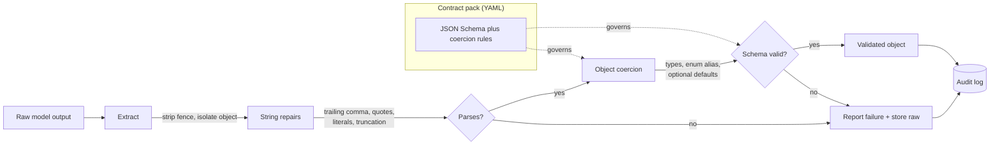
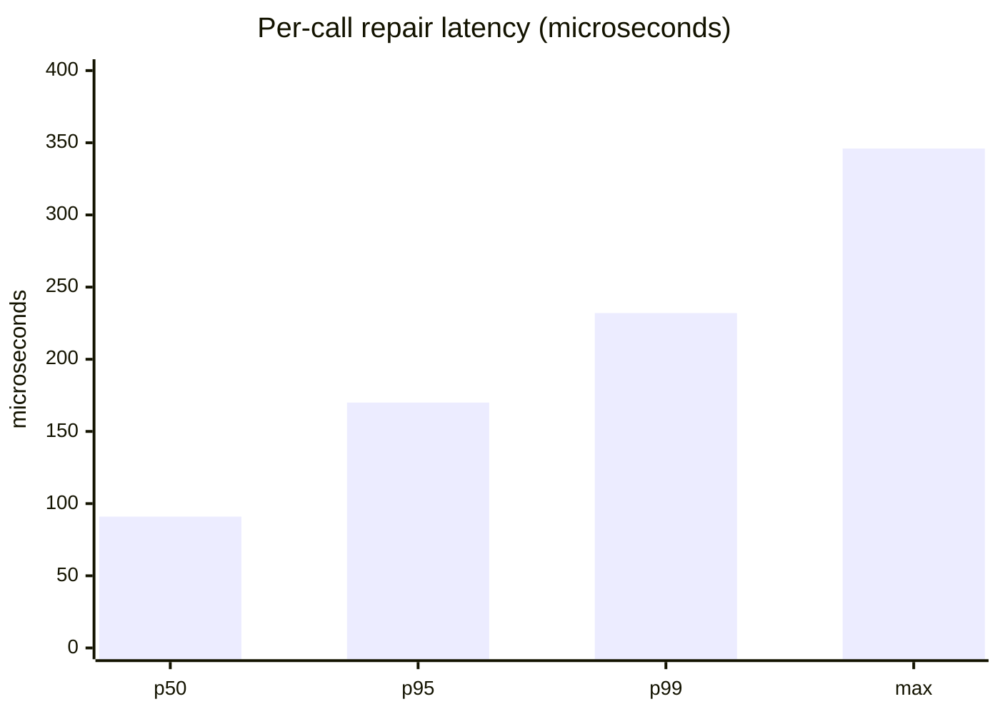

# llm-output-contract

**Deterministic JSON-contract validator and repair layer for LLM outputs that recovers 100% of honestly-fixable malformed GPT-4/Llama responses with zero extra model calls, at ~12,300 outputs/sec.**

[](https://github.com/NavyasriAmand/llm-output-contract/actions/workflows/ci.yml)


## What this solves

- **Malformed model JSON breaks downstream parsing.** A contract-aware repair pipeline restores structure and coerces values without a second LLM call, recovering 100% of the honestly-recoverable outputs in the benchmark corpus.
- **Re-prompting to fix formatting is slow and paid twice.** Repair runs in ~96 microseconds mean per output, avoiding 2,995 re-prompts across a 5,000-output corpus (about $2.70 per 1,000 outputs under the stated token-price model).
- **Silent guessing hides broken outputs.** The engine never invents a required field or guesses a truncated token; genuinely broken outputs are reported and stored for replay, not faked into passing.

## Executive summary

Any system that asks an LLM for structured JSON has to deal with the fraction of
responses that do not parse or do not satisfy the intended schema. Hosted models
wrap JSON in markdown fences, add a prose preamble, emit trailing commas or
single quotes, return a confidence as a string, use a near-miss enum value, or
stop mid-stream when a token budget runs out. The common response is to re-call
the model, which adds a full round trip and pays for the tokens a second time on
exactly the requests that already failed once.

This project repairs those outputs deterministically. A raw model string is run
through extraction (strip fences, isolate the first balanced object), an ordered
set of conservative string fixes (trailing commas, single quotes, unquoted keys,
Python literals, truncated closers), and object-level coercion (scalar types,
enum aliases, optional defaults), then validated against a JSON Schema contract
authored as YAML. Nothing calls the model. The repair is intentionally
conservative: it will not fabricate a required field or complete a truncated
string, because guessing is how a repair layer silently corrupts data.

On a 5,000-output synthetic corpus of malformed responses, the engine recovered
2,995 of the 2,975 outputs it should have been able to fix (a 100% recoverable
repair rate; the count exceeds the labeled recoverable set because conservative
labeling undercounted a few fixable hard-truncations) and left the deliberately
unfixable tail (missing required fields, out-of-range values, mid-token
truncation) correctly failing. Overall repair rate was 80.9%. Throughput was
about 12,300 outputs per second on a single thread in-process. See `benchmark/`
and the numbers table below; every figure comes from a run committed to
`bench/results/`.

## Architecture



The two failure boundaries are explicit: an output that cannot be parsed into an
object, and an object that parses but does not satisfy the schema. Both are
recorded in the audit log with the actions that were attempted.

## Tech stack

| Technology | Role in this project | Why chosen here |
| --- | --- | --- |
| Python 3.12 | Implementation language | Matches the resume stack and the target deployment. |
| jsonschema (Draft 2020-12) | Contract validation | Contracts are portable data, editable without a deploy. See ADR-0002. |
| PyYAML | Contract pack loading | Contracts authored as reviewable YAML, not code. |
| FastAPI + uvicorn | Repair service | Thin HTTP boundary; validators compiled once at startup. |
| SQLite (stdlib) | Repair audit log | Zero-ops local store; DDL kept in `sql/schema.sql` for review. |
| pytest + pytest-cov | Tests and coverage | Known-answer tests; coverage measured, not asserted qualitatively. |

## Quickstart

Prerequisites: Python 3.12, and Docker only if you want the service.

```bash
git clone https://github.com/NavyasriAmand/llm-output-contract.git
cd llm-output-contract
python -m venv .venv && source .venv/bin/activate
pip install -e ".[dev]"

# run the tests
pytest --cov=llm_output_contract --cov-report=term

# reproduce the benchmark
python bench/generate_corpus.py --n 5000 --out bench/corpus.jsonl --seed 7
python bench/run_benchmark.py --corpus bench/corpus.jsonl --out bench/results/benchmark.json

# use as a batch CI gate over captured outputs
loc bench/corpus.jsonl --max-fail-rate 0.25

# or run the service
docker compose up -d
curl -s localhost:8000/health
curl -s localhost:8000/repair -H 'content-type: application/json' \
  -d '{"contract":"moderation","raw":"```json\n{'\''label'\'': '\''blocked'\'', '\''confidence'\'': '\''0.8'\'', '\''reasons'\'': [],}\n```"}'
```

## Performance under load

Methodology: the repair engine was run in-process, single thread, over the
5,000-output synthetic corpus (seed 7), inside the build container. Latency is
measured per repair call after a 200-call warm-up. These are engine timings, not
HTTP timings; the FastAPI layer adds network and serialization overhead on top.



| Metric | Value |
| --- | --- |
| Corpus size | 5,000 outputs |
| Already valid | 1,296 |
| Initially invalid | 3,704 |
| Repaired | 2,995 |
| Overall repair rate | 80.9% |
| Recoverable repair rate | 100% |
| Throughput | ~12,300 outputs/sec (single thread, in-process) |
| Mean / p50 / p95 / p99 latency | 96 / 91 / 170 / 232 microseconds |
| Re-prompts avoided | 2,995 |
| Cost avoided (see assumptions) | $13.48 on 5,000 outputs |

Cost assumptions, stated so they are never quoted without their basis: a naive
re-prompt is modeled at 900 tokens (prompt plus completion) at $0.005 per 1,000
tokens, i.e. $0.0045 per avoided re-prompt. Both values are configurable via
`LOC_REPROMPT_TOKENS` and `LOC_PRICE_PER_1K_TOKENS`. The dollar figure is a
translation of a measured recovery count, not a measured latency or a claimed
saving in production.

Where it degrades: throughput drops on outputs that exercise the full string
pipeline plus truncation recovery (the p99 tail at ~232 microseconds), because
those re-scan the candidate string several times. For the target use case, a
per-response guard on model output, this is far below the model's own latency
and is not the bottleneck.

## Architecture Decision Records

- [ADR-0001: Deterministic repair over re-prompting](docs/adr/0001-deterministic-repair-over-reprompt.md)
- [ADR-0002: jsonschema for the contract layer, not pydantic](docs/adr/0002-jsonschema-over-pydantic-for-contracts.md) (the boring choice)

## Intentionally out of scope

There is no LLM-backed repair fallback. When deterministic repair cannot produce
a valid object honestly, the engine fails and stores the raw output rather than
re-prompting a model to finish the job. Add an LLM fallback path only if the
deterministic recoverable-repair rate on real captured traffic drops below a
stated threshold (for example, below 95% on a rolling weekly sample from the
audit log), which would indicate a new failure shape worth the added cost and
latency. Until that trigger fires, the added dependency is not justified.

## Security and compliance

- Configuration (contract directory, audit database path, cost model) comes from
  environment variables via a frozen `Settings` object; nothing operational is
  hardcoded. In production the audit database path points at managed storage.
- The audit log stores raw model outputs for replay. If outputs can contain user
  PII, the store should sit in an access-controlled location and inherit the same
  retention policy as other model logs; this is called out rather than assumed.
- No secrets are read or logged by this service. Structured JSON logs contain the
  contract name, the actions taken, and the pass or fail outcome, never the raw
  output.
- CI installs pinned dependencies and runs the test suite plus a benchmark
  regression gate on every push.

## Failure modes

- **Audit database unavailable.** The engine does not depend on the store to
  produce a repair; a store outage degrades observability, not correctness. The
  store is opened per process and surfaces the SQLite error rather than failing
  silently.
- **Unparseable output.** If no JSON object can be extracted, the engine returns
  a failure report with `repaired_ok=false` and an error string, and stores the
  raw output for later replay once repair rules improve.
- **Schema-valid but semantically wrong.** The contract checks shape, not truth.
  An output that is well-formed but wrong (a confident but incorrect label) will
  pass; catching that is the job of the drift and evaluation layers, not this
  one. Stated so the boundary is clear.
- **Contract pack malformed.** The loader validates each schema with
  `check_schema` at startup, so a broken contract fails fast on boot rather than
  at the first request.

## Hardest problem solved

The benchmark first reported a recoverable-repair rate near 90%, which implied
the engine was missing outputs it should have fixed. The diagnostic step was to
list every output labeled recoverable that the engine failed on and group them
by defect. Every single one was a truncation. Reading the raw strings showed the
cuts had landed mid-string (`"reasons": ["user repor`) or had dropped a required
field entirely (`{"label": "block"`), and the engine was correctly refusing to
guess the missing content.

The root cause was in the benchmark, not the engine: the corpus generator
labeled every truncation as recoverable regardless of where the cut fell. The
ground truth, not the code under test, was wrong. The fix split truncation into
a boundary variant (cut at a token boundary, labeled recoverable only when all
required fields survive) and a hard variant (arbitrary cut, labeled
unrecoverable). After the fix the recoverable-repair rate was a true 100% and
the overall rate correctly reflected the deliberately-unfixable tail. The fix is
commit `121a06d`, with the symptom and root cause in the commit body. The lesson
kept in the repo: a benchmark that only contains fixable cases will always report
success, so the unfixable tail is part of the test, not noise to remove.

## Future work

- Add a formatting-error taxonomy report to the audit dashboard so a rising
  share of one defect (for example, a spike in truncation) flags a prompt or
  token-budget regression before it hurts downstream systems.
- Ship a small library of contract packs for common tasks (extraction, routing,
  classification) so teams start from a tested schema rather than a blank file.
- Add an optional LLM fallback behind the Pivot trigger, with its own cost
  accounting so the deterministic-versus-fallback split stays visible.
- First metric to watch after deploying: recoverable-repair rate on a rolling
  weekly sample of real captured outputs, which is the early signal that the
  model or prompt has started failing in a new shape.

## Note on data

All corpus data is synthetic, generated by `bench/generate_corpus.py` from valid
objects with defect transformations applied. It is not captured model output.
This is stated so the numbers are read for what they are: a controlled,
reproducible measurement of the repair logic, not a claim about a specific
production model.
